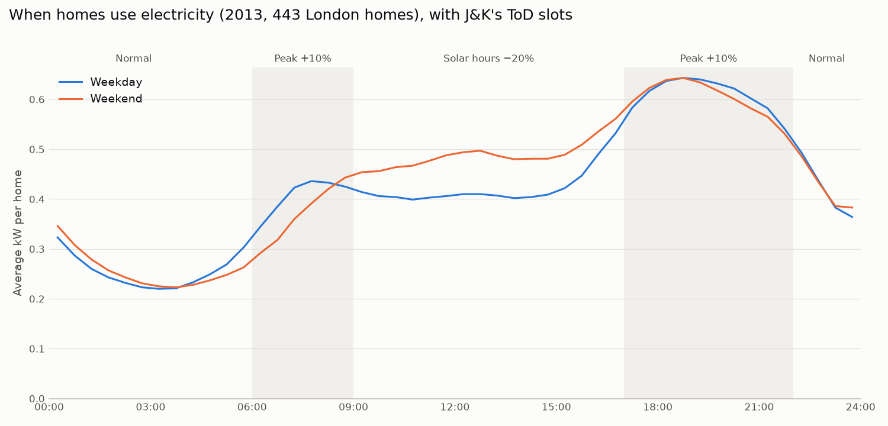
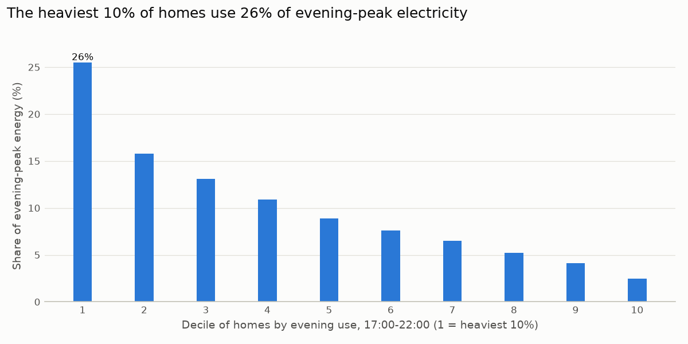
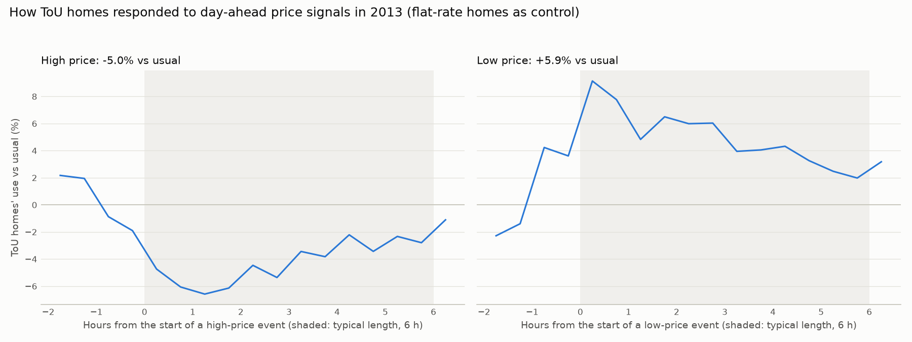
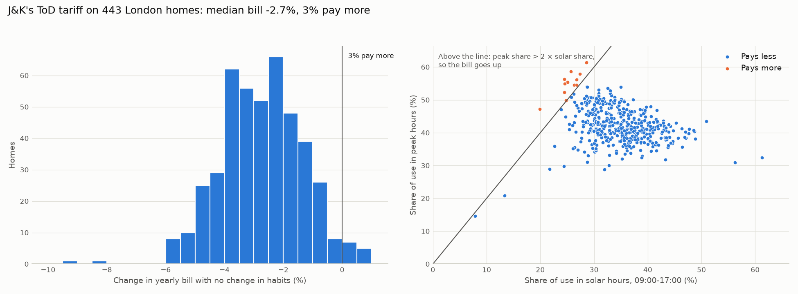

# PeakShift: Do time-of-day prices change how homes use electricity?
## Data

Source: [Low Carbon London smart-meter data](https://data.london.gov.uk/dataset/smartmeter-energy-use-data-in-london-households)
(UK Power Networks, London Datastore, CC BY 4.0). 168 CSV files of 1M rows each
(~167M rows, 8.5 GB). One row = one home's electricity use in one half-hour, Nov 2011 – Feb 2014.

| Column in file | Renamed to | Meaning | Example | Stored as |
|---|---|---|---|---|
| `LCLid` | `household_id` | Smart-meter / household ID | MAC000002 | text |
| `stdorToU` | `tariff_group` | `Std` = flat rate, `ToU` = dynamic time-of-use prices in 2013 | Std | text |
| `DateTime` | `ts_text` | Half-hour of the reading | 2012-10-12 00:30:00.0000000 | text, 7 decimal places |
| `KWH/hh (per half hour) ` | `kwh_text` | Energy used in that half-hour (kWh) | 0.347 | text with a leading space; the name ends in a space |

## Data cleaning

| Stage | Rows | Homes |
|---|---|---|
| Raw 2013 sample | 8,394,487 | 500 |
| After rule-based cleaning | 7,902,768 | 452 |
| After AI-assisted fault removal | 7,730,496 | 443 (222 flat-rate, 221 time-of-use) |

- **Audit (SQL):** 4.2% of readings missing, 5,735 duplicate rows, 2 corrupt rows, 1,441 all-zero days.
  The data is heavily skewed (median 0.116 kWh per half hour, max 8.285), so outliers are judged
  against a physical limit (11.5 kWh per half hour = 100 A × 230 V), not IQR or z-scores.
- **Rules (pandas):** removed duplicates, filled gaps of up to 1 hour by straight-line interpolation,
  removed all-zero and incomplete days, and kept homes with at least 329 complete days.
- **AI (Isolation Forest):** scored all 164,641 home-days against each home's usual day.
  67% of its top-1% flags were confirmed meter faults; the rest were real but unusual days and were kept.
  It ranked 86% of all fault days in its top 1%. A rule (6+ hours of zeros or a frozen reading) then
  removed 1,282 fault days, 57% of them from just 5 meters.
- Every remaining day has all 48 half-hourly readings, with no duplicates or missing values.

## Findings: when homes use electricity

- A typical home uses 8.4 kWh/day (3,081 kWh/yr), within 4% of Ofgem's 2013 "typical" UK home (3,200 kWh/yr).
- The evening peak is 18:00–19:30 (0.64 kW per home), 2.9× the quietest half-hour.
- Winter use is ~1.6× summer. March 2013 stayed high: it was the UK's coldest March in ~50 years.
- Median load factor is 0.09: a home's peak is ~11× its average.
- The heaviest 10% of homes use 25.5% of evening-peak electricity.

## Findings: did price signals change behaviour?

- At high prices (5.7× normal), time-of-use homes used 5.0% less than usual (95% range 3.5–6.2%),
  measured against flat-rate homes at the same moments (difference-in-differences).
- At low prices they used 5.9% more (95% range 4.3–7.9%).
- Implied price elasticity is about −0.03: household demand barely responds to price in the short run.

## Findings: J&K's time-of-day tariff on these homes

- Applied J&K's 2026 ToD tariff (solar hours 09:00–17:00 at −20%; peak hours 06:00–09:00 and 17:00–22:00 at +10%) to 443 homes' real load shapes.
- With no change in habits, 97% of homes pay less (median −2.7%). The 2.7% that pay more see at most +0.7%, and break even by moving ~2% of their peak-hour use into solar hours.
- A home pays more only if its peak share is more than double its solar share.
- Utility revenue falls 2.8%. Revenue-neutral alternatives: +2.9% on all rates, or a 16.7% peak surcharge instead of 10%.
- With the trial's measured elasticity, peak-hour use falls only 0.3%: the tariff changes bills, not behaviour.
- Caveat: London load shapes (heating, little AC). The method transfers to India; the numbers don't.

## AI bill notes: a local LLM with two fact checks

Each home gets a short note on what the tariff means for it. Code computes every number, including *why*
the bill changes (the solar-hour saving and the peak-hour extra cost). A local LLM (Llama 3.2 3B via Ollama)
only writes the words. Two automatic checks guard every note:

1. **No invented numbers:** every number in the note must appear in the facts.
2. **No missing facts:** the note must include the bill change, the saving and the extra cost
   (plus the break-even shift for homes that pay more).

A failing draft goes back to the model with the problem listed (up to 3 tries), then a plain template is used.

| Version | Passed first try | After feedback | Template | Final notes failing a check |
|---|---|---|---|---|
| v1: number check only | 30/30 | 0 | 0 | 0 |
| v2: reason in the facts + coverage check | 28/30 | 2 | 0 | 0 |

v1 passed every check, yet one note said a bill falls "because they use electricity mainly during peak
hours", which is backwards. A number check can't see reasoning, so v2 moved the reasoning into code.